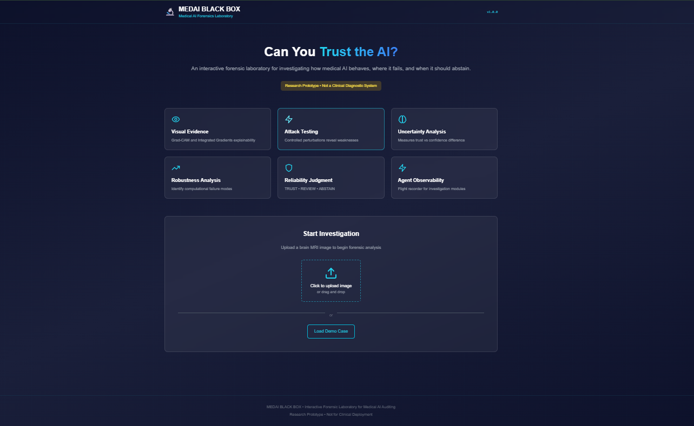
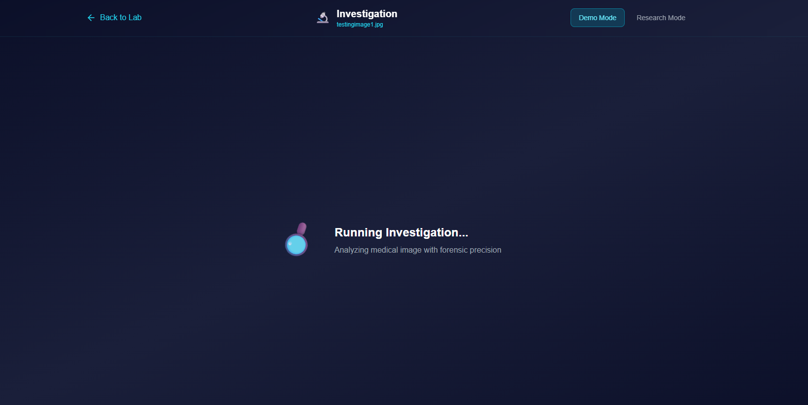
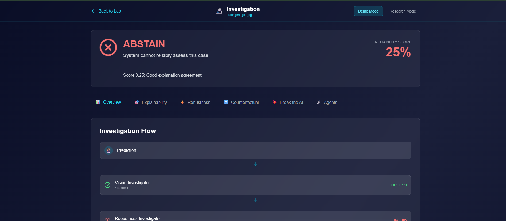
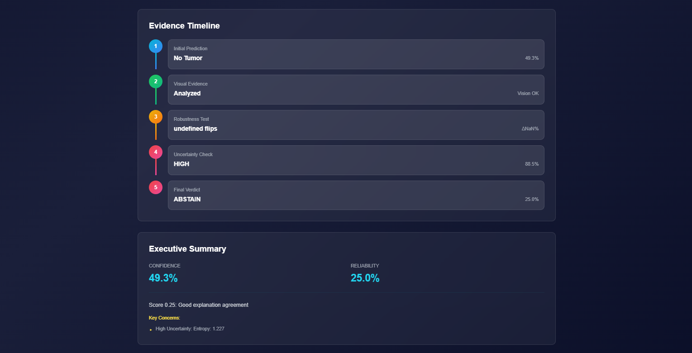

# MEDAI BLACK BOX

## Interactive Forensic Laboratory for Auditing Medical AI

**Can you trust this AI prediction?**

MEDAI BLACK BOX is a research-focused interactive system for investigating how medical AI behaves, where it fails, and when it should abstain from making a prediction.

Rather than displaying only a prediction and confidence score, MEDAI BLACK BOX performs a structured forensic investigation using **explainability, robustness, uncertainty, failure analysis, and deterministic reliability assessment**.

> **Research prototype — not intended for clinical diagnosis or patient-care decisions.**

---

## Screenshots

### Landing Page

Upload a brain MRI image and start an AI investigation.



### Live Investigation

Monitor the investigation as the forensic pipeline executes.



### Investigation Graph

Inspect the status and execution of individual investigation components.



### Evidence Timeline

Review how confidence, reliability, evidence, and investigation findings contribute to the final verdict.



---

# Project Overview

## Problem

Medical AI systems commonly expose predictions and confidence scores, but confidence alone does not establish reliability.

A model may:

* Make an incorrect prediction with high confidence
* Rely on unstable or irrelevant visual evidence
* Change its prediction under small perturbations
* Produce uncertain predictions near decision boundaries
* Fail without providing a mechanism for human review or abstention

MEDAI BLACK BOX addresses this problem by treating every prediction as an **auditable case** rather than a simple classification output.

---

# Solution

MEDAI BLACK BOX conducts a structured investigation of each prediction:

1. Generate the model prediction
2. Analyze visual evidence
3. Test prediction robustness
4. Quantify uncertainty
5. Detect potential failure modes
6. Aggregate evidence
7. Produce a deterministic reliability assessment
8. Return a **TRUST / REVIEW / ABSTAIN** verdict

The goal is not simply to answer:

> **"What did the model predict?"**

but also:

> **"How much evidence do we have that this prediction is reliable?"**

---

# Core Architecture

## Investigation Pipeline

```text
CASE
(Medical Image)
      │
      ▼
PREDICTION ENGINE
      │
      ▼
VISION INVESTIGATOR
Grad-CAM + Integrated Gradients
      │
      ▼
ROBUSTNESS INVESTIGATOR
Perturbation Testing
      │
      ▼
UNCERTAINTY INVESTIGATOR
Entropy + Confidence Analysis
      │
      ▼
FAILURE ANALYZER
Failure Pattern Detection
      │
      ▼
RELIABILITY JUDGE
Deterministic Decision Engine
      │
      ▼
TRUST / REVIEW / ABSTAIN
```

---

# Key Features

## 1. AI Autopsy

MEDAI BLACK BOX performs an automated forensic investigation of a model prediction.

The investigation can include:

* Prediction generation
* Visual evidence analysis
* Grad-CAM
* Integrated Gradients
* Explanation agreement
* Perturbation testing
* Uncertainty estimation
* Failure-mode analysis
* Reliability scoring
* Final verdict generation

---

## 2. Explainability Forensics

Multiple attribution methods are used to inspect the evidence supporting a prediction.

### Grad-CAM

Generates class-specific activation maps to identify image regions contributing to the model's prediction.

### Integrated Gradients

Provides feature attribution by integrating gradients along a path from a baseline input to the observed image.

### Explanation Agreement

The system can compare explanations using quantitative similarity measures such as:

* Cosine similarity
* Intersection-over-Union (IoU)
* Activated-region overlap

The objective is to determine whether different explanation methods provide consistent evidence.

---

## 3. Attack This Prediction

MEDAI BLACK BOX performs controlled computational stress testing through image perturbations.

Supported perturbation categories include:

* Brightness changes
* Contrast changes
* Gaussian noise
* Blur
* Rotation
* Region occlusion

Each perturbation is evaluated for its effect on:

* Predicted class
* Confidence
* Prediction stability
* Sensitivity

This allows potentially fragile predictions to be identified.

---

## 4. Robustness Analysis

The robustness investigator measures how stable a prediction remains under controlled changes to the input.

Key measurements include:

* Prediction flips
* Confidence changes
* Perturbation sensitivity
* Stability across transformations
* Most influential perturbation

A prediction that changes substantially under small input modifications may warrant additional review.

---

## 5. Uncertainty Quantification

The system analyzes model uncertainty using model-output statistics including:

* Predictive entropy
* Normalized entropy
* Top-class confidence
* Top-2 confidence gap
* Decision margin

These measurements provide additional information beyond the raw prediction confidence.

---

## 6. Trust ≠ Confidence

A central design principle of MEDAI BLACK BOX is:

> **Model confidence is not the same as model reliability.**

### Model Confidence

Represents what the model claims through its output probabilities.

### Model Reliability

Represents the strength and consistency of evidence supporting that prediction.

Reliability assessment considers multiple signals, including:

* Confidence
* Uncertainty
* Robustness
* Explanation agreement
* Detected failure modes

---

## 7. Reliability Judge

The Reliability Judge converts investigation evidence into a deterministic verdict.

### TRUST

The available evidence is sufficiently consistent and stable under the configured rules.

### REVIEW

The evidence is mixed or contains warning signals requiring human review.

### ABSTAIN

The system determines that the available evidence is insufficient for a reliable automated assessment.

The verdict is generated through explicit decision rules rather than an external LLM.

---

## 8. Deterministic Investigation Agents

The system separates the investigation into specialized modules:

| Investigator             | Responsibility                      |
| ------------------------ | ----------------------------------- |
| Vision Investigator      | Explainability and visual evidence  |
| Robustness Investigator  | Perturbation and stability analysis |
| Uncertainty Investigator | Uncertainty estimation              |
| Failure Analyzer         | Failure-pattern detection           |
| Reliability Judge        | Final reliability assessment        |

The architecture is intentionally deterministic and does not require an external LLM for the core investigation pipeline.

---

## 9. Agent Flight Recorder

The Agent Flight Recorder provides execution observability.

It records information such as:

* Agent name
* Execution status
* Start and end timestamps
* Latency
* Input/output summaries
* Error information

This provides an audit trail for the investigation pipeline and connects the system conceptually to research on **AI agent reliability and observability**.

---

## 10. Evidence Timeline

The Evidence Timeline provides a visual representation of how investigation evidence evolves across the pipeline.

It can expose:

* Prediction confidence
* Reliability signals
* Investigation stages
* Detected concerns
* Final assessment

---

## 11. Investigation Graph

An interactive React Flow visualization represents the investigation pipeline as a graph.

Features include:

* Investigation nodes
* Agent status
* Pipeline progression
* Evidence inspection
* Execution state visualization

---

## 12. Research and Demo Modes

### Demo Mode

Designed for simple and guided exploration.

### Research Mode

Provides greater transparency through detailed metrics and investigation information.

---

## 13. Counterfactual Lab

The Counterfactual Lab allows controlled modification of image evidence and re-analysis.

Examples include:

* Region masking
* Noise injection
* Brightness modification
* Other controlled transformations

The purpose is to observe how the model's computational behavior changes when the input is modified.

> Counterfactual analysis in this system is descriptive rather than causal.

---

## 14. Break the AI

The system supports controlled failure scenarios for reliability testing.

Examples include:

* Disabling investigation components
* Removing evidence sources
* Simulating failures
* Testing degraded execution

This helps evaluate whether the system can fail gracefully rather than silently producing misleading results.

---

# Technical Stack

## Backend

* **Python**
* **FastAPI**
* **PyTorch**
* **torchvision**
* **NumPy**
* **SciPy**
* **scikit-learn**
* **OpenCV**

## Frontend

* **Next.js 14**
* **React**
* **TypeScript**
* **Tailwind CSS**
* **Framer Motion**
* **React Flow**
* **Recharts**
* **Lucide React**
* **Axios**

## Model

* **ResNet18**
* Brain tumor classification
* Four output classes:

  * No Tumor
  * Glioma
  * Meningioma
  * Pituitary

The core investigation pipeline does not depend on an external LLM.

---

# Installation

## Prerequisites

* Python 3.10+
* Node.js 18+
* npm

## Clone the Repository

```bash
git clone https://github.com/iqrasafdarr/medai-black-box.git
cd medai-black-box
```

## Backend Setup

### Windows PowerShell

```powershell
python -m venv venv
.\venv\Scripts\Activate.ps1
pip install -r requirements.txt
```

### Linux / macOS

```bash
python3 -m venv venv
source venv/bin/activate
pip install -r requirements.txt
```

---

# Frontend Setup

```bash
cd frontend
npm install
```

---

# Running the Application

## Terminal 1 — Backend

From the project root:

### Windows

```powershell
.\venv\Scripts\Activate.ps1
python backend/main.py
```

### Linux / macOS

```bash
source venv/bin/activate
python backend/main.py
```

The backend runs at:

```text
http://localhost:8000
```

---

## Terminal 2 — Frontend

From the `frontend` directory:

```bash
npm run dev
```

The frontend runs at:

```text
http://localhost:3000
```

Open:

```text
http://localhost:3000
```

---

# Usage

## 1. Upload a Medical Image

Upload or drag-and-drop a brain MRI image.

Supported formats:

* PNG
* JPEG/JPG
* BMP
* TIFF

---

## 2. Run the Investigation

The system starts the forensic investigation pipeline and reports investigation progress through the interface.

---

## 3. Review Findings

### Overview

Displays:

* Final verdict
* Reliability score
* Evidence timeline
* Executive summary

### Explainability

Displays:

* Grad-CAM
* Integrated Gradients
* Explanation evidence

### Robustness

Displays:

* Perturbation results
* Confidence changes
* Prediction stability
* Failure indicators

### Agents

Displays:

* Investigation status
* Execution information
* Agent-level results

---

# Investigation Agents

## Vision Investigator

### Input

* Original image
* Model prediction
* Optional lesion mask

### Output

* Grad-CAM heatmap
* Integrated Gradients attribution
* Explanation similarity metrics
* Activated-region analysis

### Methodology

The investigator generates class-specific attribution maps and compares the resulting evidence using quantitative similarity measures.

---

## Robustness Investigator

### Input

* Original image
* Model reference

### Output

* Perturbation results
* Prediction flip count
* Confidence changes
* Most sensitive perturbation

### Methodology

The investigator evaluates multiple controlled image transformations and records their effect on the model output.

---

## Uncertainty Investigator

### Input

* Original image
* Model prediction

### Output

* Predictive entropy
* Normalized entropy
* Confidence gap
* Decision margin

### Methodology

The investigator analyzes the model's output probability distribution to estimate uncertainty and separation between competing classes.

---

## Failure Analyzer

### Input

Results from:

* Vision Investigator
* Robustness Investigator
* Uncertainty Investigator

### Output

* Potential failure modes
* Severity indicators
* Contributing factors
* Critical failure count

### Methodology

Evidence from multiple investigation stages is aggregated and evaluated against configured rules.

---

## Reliability Judge

### Input

* Prediction
* Agent results
* Investigation evidence
* Configuration thresholds

### Output

* TRUST / REVIEW / ABSTAIN
* Trust score
* Triggered rules
* Evidence summary

### Example Decision Rules

The current decision framework can incorporate signals such as:

* High confidence
* Low uncertainty
* Prediction stability
* Explanation agreement

Example thresholds:

```text
High confidence:        ≥ 0.85
Low uncertainty:        ≤ 0.30
Explanation agreement:  ≥ 0.40
```

The exact thresholds should be interpreted as configurable research parameters rather than clinically validated cutoffs.

---

# Configuration

Reliability thresholds can be configured through the project configuration system.

Example:

```yaml
high_confidence_threshold: 0.85
low_uncertainty_threshold: 0.30
acceptable_flip_rate: 0.10
acceptable_confidence_delta: 0.15
explanation_agreement_threshold: 0.40
```

These values are intended for experimentation and should not be interpreted as clinical thresholds.

---

# API

## `POST /api/autopsy`

Runs a comprehensive investigation.

**Input:** Medical image

**Output:** Forensic investigation report.

---

## `POST /api/predict`

Runs prediction only.

**Input:** Medical image

**Output:** Predicted class and confidence.

---

## `POST /api/explainability`

Runs visual explanation analysis.

**Input:** Medical image

**Output:** Explainability results.

---

## `POST /api/robustness`

Runs perturbation analysis.

**Input:** Medical image

**Output:** Robustness and sensitivity results.

---

## `POST /api/uncertainty`

Runs uncertainty analysis.

**Input:** Medical image

**Output:** Uncertainty metrics.

---

## `GET /api/config`

Returns system configuration and available methods.

---

# Experimental Evaluation

MEDAI BLACK BOX is designed as a research prototype for evaluating reliability signals around medical-image classification.

Potential evaluation dimensions include:

### Prediction Performance

* Accuracy
* Precision
* Recall
* F1-score
* Per-class performance

### Robustness

* Prediction flip rate
* Confidence delta
* Perturbation sensitivity
* Stability under transformations

### Explainability

* Explanation similarity
* Region overlap
* Attribution consistency

### Uncertainty

* Predictive entropy
* Confidence gap
* Calibration analysis

### Reliability

* TRUST / REVIEW / ABSTAIN distribution
* Reliability score
* Failure-mode frequency
* Abstention behavior

---

# Limitations

## Research Prototype

MEDAI BLACK BOX is **not a clinical system**.

It has not been validated for:

* Clinical diagnosis
* Patient management
* Hospital deployment
* Regulatory use

---

## Model Limitations

* Single CNN backbone
* No ensemble model
* Single 2D image input
* No patient metadata
* No longitudinal information
* Four-class classification scope

---

## Robustness Limitations

Synthetic perturbations do not necessarily represent real-world medical imaging artifacts.

For example:

* Brightness changes are not equivalent to scanner variation
* Gaussian noise is not equivalent to acquisition artifacts
* Blur is not equivalent to all real imaging degradation

---

## Uncertainty Limitations

The current system primarily uses model-output statistics.

It does not provide full Bayesian or ensemble uncertainty.

Entropy and confidence measures should therefore not be interpreted as guarantees of calibrated uncertainty.

---

## Causality Limitations

Counterfactual and perturbation experiments are computational interventions.

They do **not** establish clinical causality.

Changes in a model's prediction after an image manipulation should be interpreted as evidence of computational sensitivity rather than proof of causal relationships.

---

# Research Contributions

## Medical AI Reliability

MEDAI BLACK BOX explores a framework for moving beyond prediction confidence toward evidence-based reliability assessment.

## Explainable AI

The system integrates multiple explanation techniques and evaluates their agreement.

## Robustness Auditing

Controlled perturbation testing exposes prediction instability and sensitivity.

## Uncertainty Analysis

Model-output uncertainty is incorporated into the reliability assessment.

## Deterministic AI Auditing

The investigation pipeline uses explicit computational modules and decision rules rather than relying on an external LLM to determine reliability.

## AI Agent Observability

The Agent Flight Recorder provides execution-level observability for the investigation components.

## Interactive Forensic Interface

The investigation graph and evidence timeline provide an interactive way to inspect how evidence contributes to the final assessment.

---

# Future Work

## Short-Term

* [ ] PDF investigation reports
* [ ] Batch case processing
* [ ] Configurable thresholds
* [ ] Improved Grad-CAM overlays
* [ ] Expanded automated testing

## Medium-Term

* [ ] Case database
* [ ] Authentication and user roles
* [ ] Multi-image sequence analysis
* [ ] Lesion-mask input
* [ ] Performance dashboard

## Long-Term

* [ ] Real-world medical imaging validation
* [ ] Multimodal model support
* [ ] Clinical validation studies
* [ ] PACS integration research
* [ ] Deployment and monitoring framework

---

# Project Structure

```text
medai-black-box/
│
├── backend/
│   └── main.py
│
├── frontend/
│   ├── app/
│   │   ├── layout.tsx
│   │   ├── page.tsx
│   │   └── globals.css
│   │
│   ├── components/
│   │   ├── Investigation.tsx
│   │   ├── VerdictCard.tsx
│   │   ├── InvestigationGraph.tsx
│   │   ├── EvidenceTimeline.tsx
│   │   ├── PerturbationResults.tsx
│   │   └── AgentFlightRecorder.tsx
│   │
│   └── next.config.js
│
├── models/
│   └── brain_tumor_model.py
│
├── explainability/
│   ├── gradcam.py
│   └── robustness.py
│
├── agents/
│   └── investigation_agents.py
│
├── experiments/
├── tests/
├── configs/
├── demo_cases/
├── data/
├── assets/
│   └── screenshots/
│       ├── screenshot-landing.png
│       ├── screenshot-running.png
│       ├── screenshot-investigation.png
│       └── screenshot-evidence-timeline.png
│
├── requirements.txt
└── README.md
```

---

# Testing

## Backend Tests

```bash
python -m pytest tests/
```

## API Health Check

```bash
curl http://localhost:8000/health
```

## Prediction

```bash
curl -X POST \
  -F "file=@image.png" \
  http://localhost:8000/api/predict
```

## Full Investigation

```bash
curl -X POST \
  -F "file=@image.png" \
  http://localhost:8000/api/autopsy
```

---

# Troubleshooting

## Backend Does Not Start

Check that the virtual environment is active:

### Windows

```powershell
.\venv\Scripts\Activate.ps1
```

Then:

```powershell
python backend/main.py
```

---

## Frontend Cannot Connect to Backend

Verify that the backend is running:

```text
http://localhost:8000/health
```

Then verify the API URL used by the frontend.

---

## Slow Inference

Check whether CUDA is available:

```bash
python -c "import torch; print(torch.cuda.is_available())"
```

On CPU-only systems, inference and perturbation analysis may take longer.

---

# Methodological References

### Grad-CAM

Selvaraju et al., *Grad-CAM: Visual Explanations from Deep Networks via Gradient-Based Localization*, 2019.

### Integrated Gradients

Sundararajan et al., *Axiomatic Attribution for Deep Networks*, 2017.

### Uncertainty

Lakshminarayanan et al., *Simple and Scalable Predictive Uncertainty Estimation using Deep Ensembles*, 2017.

---

# License

Research use only.

This repository is intended for research and educational purposes and is **not approved for clinical deployment**.

---

# Author

**Iqra Safdar**

**COMSATS University Islamabad — Sahiwal Campus**

### Research Areas

* Medical Computer Vision
* Explainable AI
* AI Model Reliability
* Trustworthy AI
* Medical AI Safety

---

# Disclaimer

> **RESEARCH PROTOTYPE ONLY**

MEDAI BLACK BOX is not a medical diagnostic system and has not been validated for clinical use.

It does not provide medical diagnoses and must not be used to make patient-care decisions.

All predictions, explanations, robustness measurements, and reliability verdicts are intended for **research and demonstration purposes only**.

---

**Last Updated:** August 2026
**Status:** Active Development
**Version:** 1.0.0 MVP
